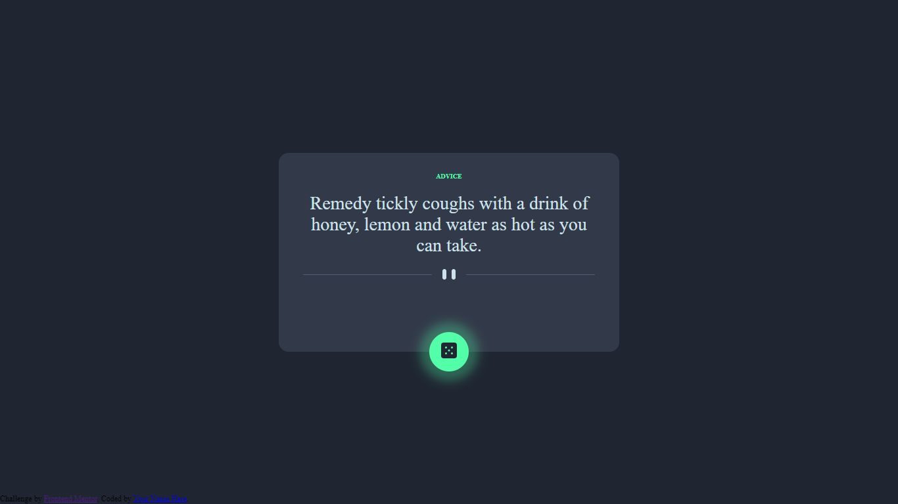

# Frontend Mentor - Advice generator app solution

This is a solution to the [Advice generator app challenge on Frontend Mentor](https://www.frontendmentor.io/challenges/advice-generator-app-QdUG-13db). Frontend Mentor challenges help you improve your coding skills by building realistic projects.

## Table of contents

- [Overview](#overview)
  - [The challenge](#the-challenge)
  - [Screenshot](#screenshot)
- [My process](#my-process)
  - [Built with](#built-with)
  - [What I learned](#what-i-learned)
  - [Useful resources](#useful-resources)
- [Author](#author)

## Overview

### The challenge

Users should be able to:

- View the optimal layout for the app depending on their device's screen size
- See hover states for all interactive elements on the page
- Generate a new piece of advice by clicking the dice icon

### Screenshot



## My process

### Built with

- Semantic HTML5 markup
- CSS custom properties
- Flexbox
- CSS Grid
- (Flexbox and Grid are always my main weapons)
- Mobile-first workflow

### What I learned
This challenge was quite easy but it has taught me some useful basic CSS layout and positioning 

```js
await fetch("	https://api.adviceslip.com/advice")
    .then((res) => (res.ok ? res.json() : Promise.reject))
    .then((json) => cb(json.slip.advice))
    .catch((err) => console.log(err));
```
I have used function other times times but I always like it. (It would be great if someone gave me
feedback about this function, for me is amazing in basic things but perhaps it isn't.)

### Useful resources

- [Example resource 1](https://api.adviceslip.com/advice) - This is the API is used.
- [Example resource 2](https://developer.mozilla.org/en-US/) - MDN is awesome.

## Author
- Frontend Mentor - [@yourusername](https://www.frontendmentor.io/profile/Haziel-Soria-Trejo)
