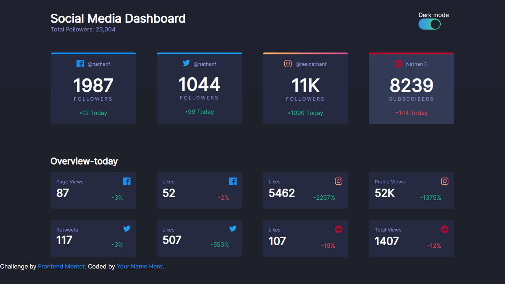

# Frontend Mentor - Social media dashboard with theme switcher solution

This is a solution to the [Social media dashboard with theme switcher challenge on Frontend Mentor](https://www.frontendmentor.io/challenges/social-media-dashboard-with-theme-switcher-6oY8ozp_H). Frontend Mentor challenges help you improve your coding skills by building realistic projects.

## Table of contents

- [Overview](#overview)
  - [The challenge](#the-challenge)
  - [Screenshot](#screenshot)
  - [Links](#links)
- [My process](#my-process)
  - [Built with](#built-with)
  - [What I learned](#what-i-learned)
  - [Continued development](#continued-development)
  - [Useful resources](#useful-resources)
- [Author](#author)
- [Acknowledgments](#acknowledgments)

## Overview

### The challenge

Users should be able to:

- View the optimal layout for the site depending on their device's screen size
- See hover states for all interactive elements on the page
- Toggle color theme to their preference

### Screenshot



### Links

- Solution URL: [My Github](https://github.com/Haziel-Soria-Trejo")

## My process

### Built with

- Semantic HTML5 markup
- CSS custom properties
- Flexbox
- [React](https://reactjs.org/) - JS library

### What I learned

My aim whit this project was to practice a couple of things I've just learnt about React-js (maybe
doing this without React would have been easier).

In this project I tried to layout using only Flexbox. It was tough but it has taught some techniques
I can use in future projects.

I had never done a switch toggle button so I must admit they are quite difficult to do but now I'm OK.

Given I struggled with the button, here it is the code i came up with.

```css
.switch {
  background-image: linear-gradient(90deg, #378fe6, #3eda82);
  display: flex;
  align-items: center;
  height: 30px;
  padding: 2.5px;
  transition: 0.4s;
  transition: var(--transition-delay);
  width: 60px;
  border-radius: 25px;
}
.theme-input {
  display: none;
}
.slider {
  --slider-diameter: 25px;
  background-color: #1f212e;
  border-radius: 50%;
  cursor: pointer;
  display: block;
  height: var(--slider-diameter);
  left: calc(100% - var(--slider-diameter));
  position: relative;
  transition: 0.4s;
  transition: var(--transition-delay);
  width: var(--slider-diameter) !important;
}
```
### Useful resources

- [Reach-js docs](https://reactjs.org/) - For any doubt I use the official docs.
- [Youtube Course](https://youtube.com/playlist?list=PLvq-jIkSeTUZ5XcUw8fJPTBKEHEKPMTKk) - (An amazing course and channel about web-dev for spanish speakers).

## Author

- Frontend Mentor - [@yourusername](https://www.frontendmentor.io/profile/Haziel-Soria-Trejo)
