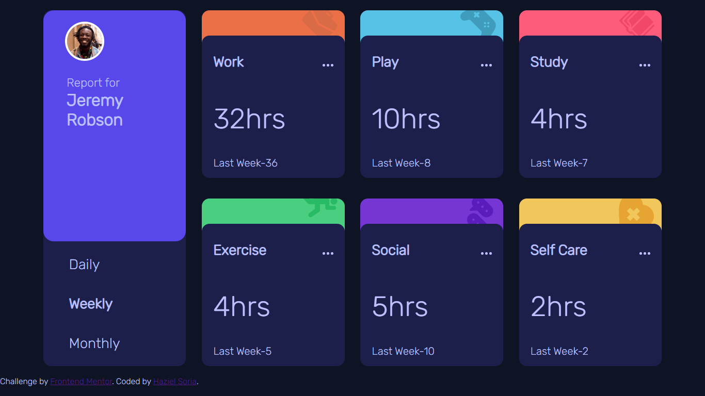

# Frontend Mentor - Time tracking dashboard solution

This is a solution to the [Time tracking dashboard challenge on Frontend Mentor](https://www.frontendmentor.io/challenges/time-tracking-dashboard-UIQ7167Jw). Frontend Mentor challenges help you improve your coding skills by building realistic projects. 

## Table of contents

- [Overview](#overview)
  - [The challenge](#the-challenge)
  - [Screenshot](#screenshot)
  - [Links](#links)
- [My process](#my-process)
  - [Built with](#built-with)
  - [What I learned](#what-i-learned)
  - [Continued development](#continued-development)
- [Author](#author)

## Overview

### The challenge

Users should be able to:

- View the optimal layout for the site depending on their device's screen size
- See hover states for all interactive elements on the page
- Switch between viewing Daily, Weekly, and Monthly stats

### Screenshot

### Links

- Solution URL: [Add solution URL here](https://time-tracking-dashboard-beta-navy.vercel.app/)
- Live Site URL: [Add live site URL here](https://github.com/Haziel-Soria-Trejo/FrontEnd-Challenges/tree/master/time-tracking-dashboard-main)

## My process

### Built with

- Semantic HTML5 markup
- CSS custom properties
- Flexbox (not too much)
- CSS Grid
- Mobile-first workflow

**Note: These are just examples. Delete this note and replace the list above with your own choices**

### What I learned

It was useful to recap how Grid works and sharp some knowledge.

Also I think the way I organize my code,  either HTML, CSS or JS, is better;more semantic
and reusable.

### Continued development
When I started working with the JSON file I got the idea to make an API, so maybe I will
do a similar project but with an API.
## Author

- Frontend Mentor - [@yourusername](https://www.frontendmentor.io/profile/Haziel-Soria-Trejo)
